# SpaceAge

It's a 2D, single-player space-themed game. The game starts with a small ship named Aadvent, and the goal is to complete assigned tasks, collect valuable gems in space, and progress by upgrading to better ships and equipment to fight and win against stronger opponents.

Currently, there are 16 different ships available for the player, each with distinct characteristics, and 11 enemy ships in the game. Depending on the hardware specifications of the player's ship, they can equip drones and laser weapons.

There are 6 different laser types and 4 rocket types available at the moment. The game features 4 different maps, and transitioning between them is possible through teleport gates, but the user's rank points must be higher than the required level of the gate.

Various systems are in place, including a mission system, a save system, and systems to keep track of game logs. The game also incorporates different effects such as particle effects and parallax.

## In-Game Screenshots
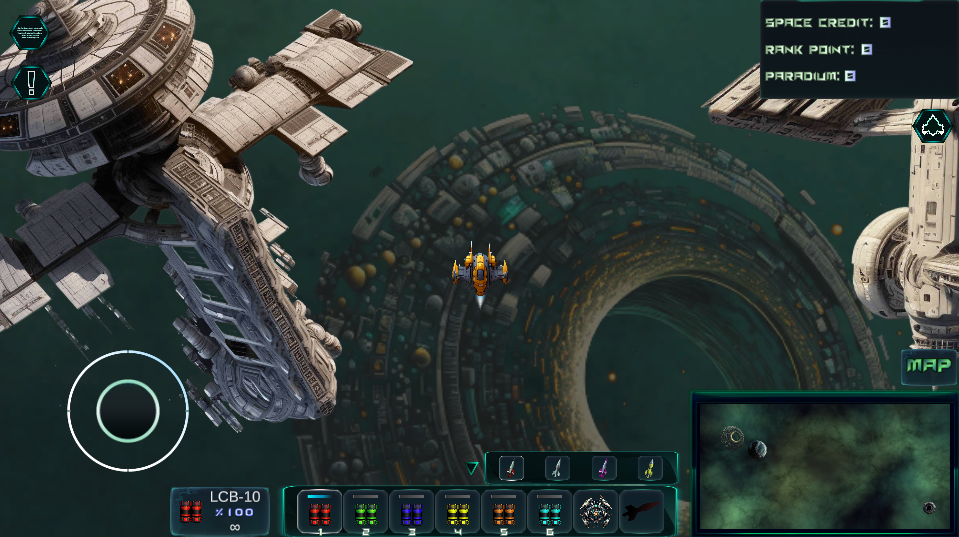
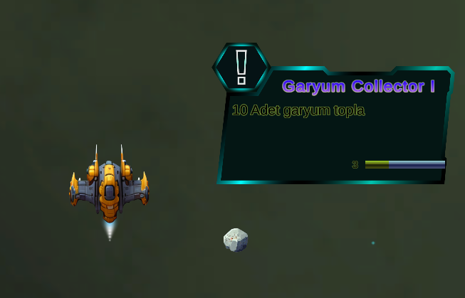
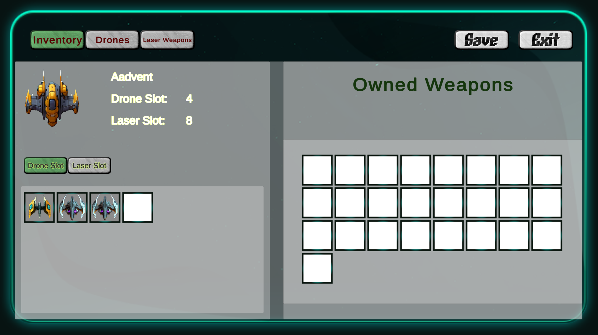
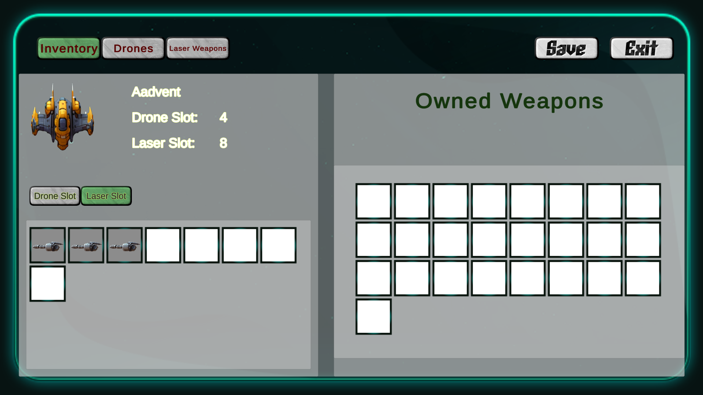
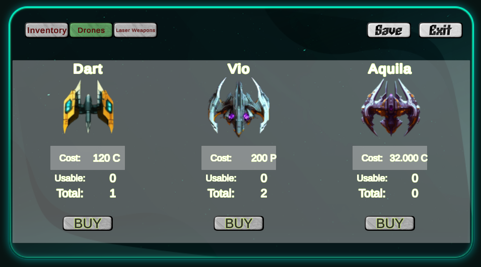
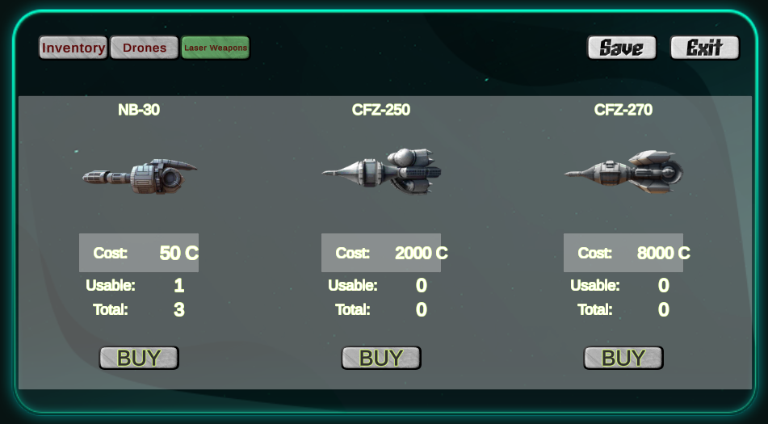
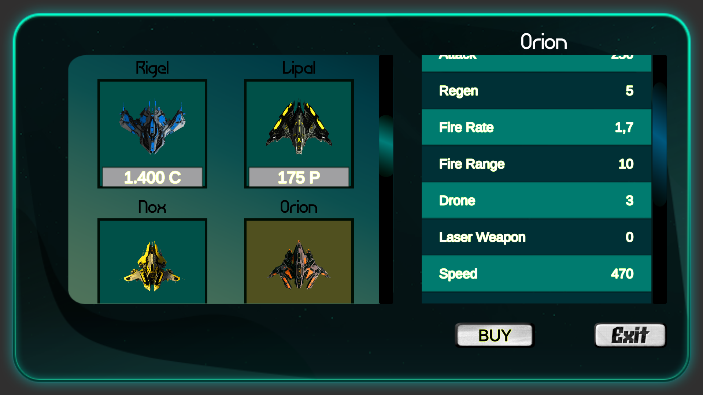
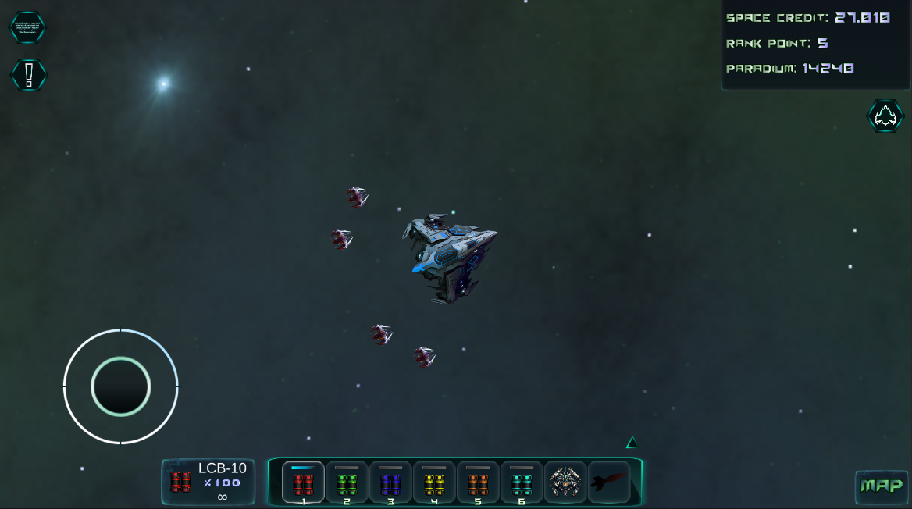
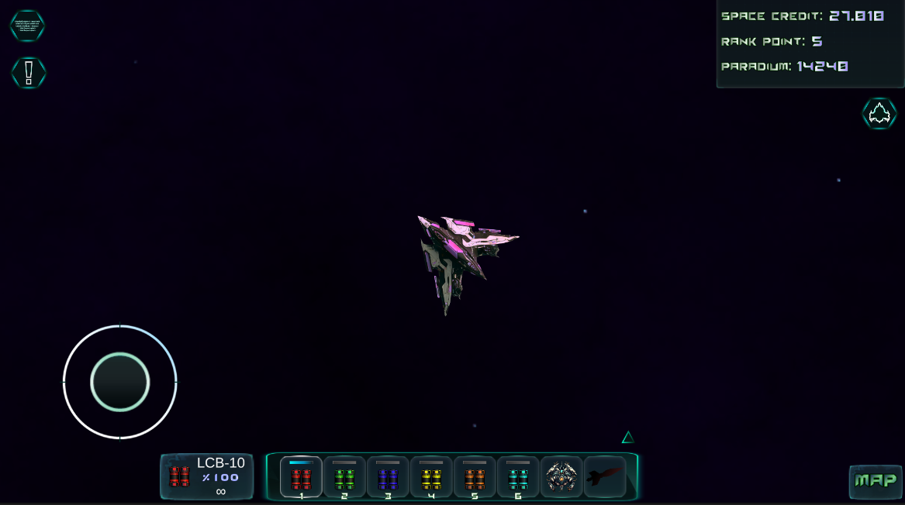
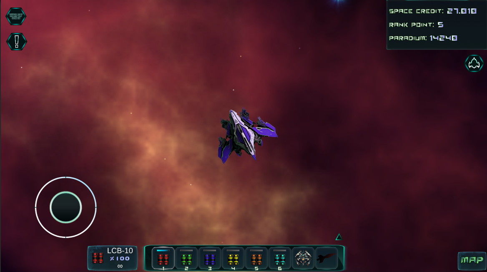
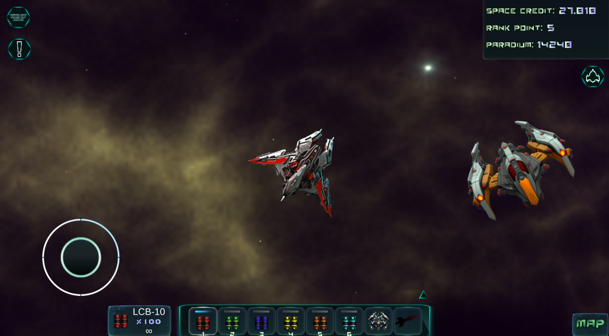
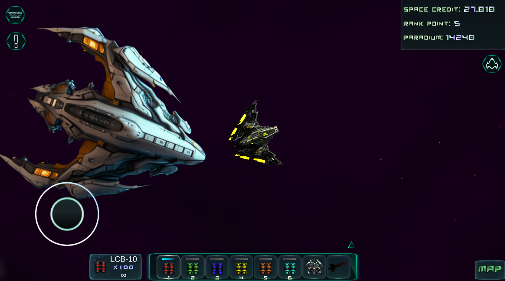
